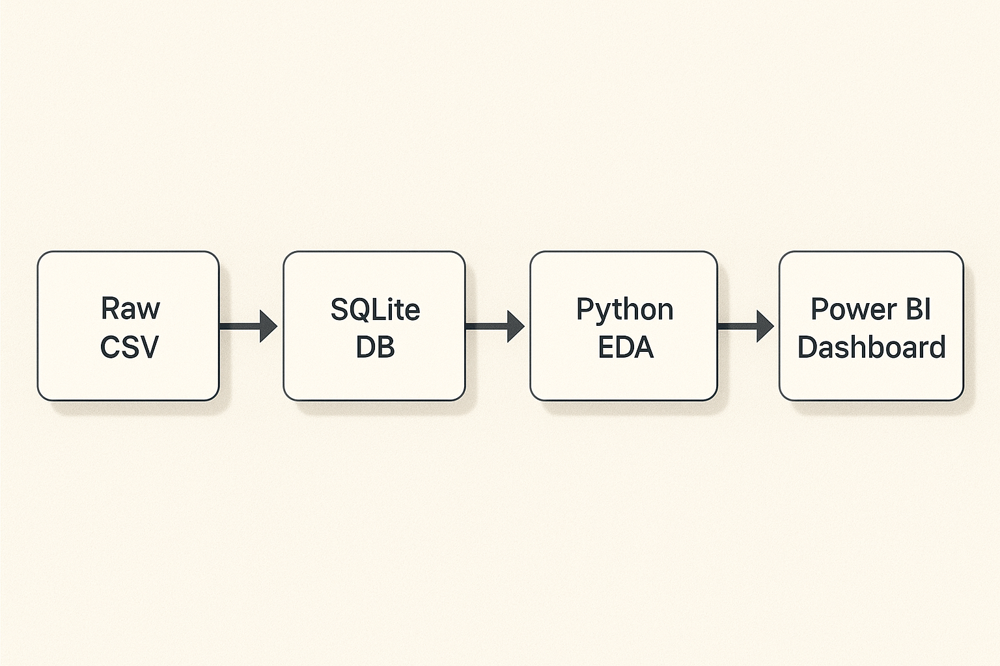

# 📊 Vendor Performance Analytics Dashboard

A complete end-to-end data analytics project designed to evaluate vendor performance using **Python**, **SQLite**, and **Power BI**.  
This project simulates a real-world business intelligence pipeline — from raw data ingestion to interactive dashboard reporting.

---

## 🚀 Project Objective

To analyze vendor-level performance based on sales, purchases, and freight costs, and to generate actionable insights that support data-driven procurement and supply chain decisions.

---

## 🛠️ Tools & Technologies

| Tool        | Purpose                                 |
|-------------|------------------------------------------|
| Python      | Data cleaning, transformation, EDA       |
| Pandas      | Data manipulation                        |
| SQLite      | Lightweight relational database          |
| SQLAlchemy  | Python-based database operations         |
| Seaborn     | Visualization for EDA (e.g., heatmaps)   |
| Power BI    | Dashboard creation & data storytelling   |
| Logging     | Script execution tracking                |

---

## 🗂️ Project Structure

```
vendor-performance-analytics/
│
├── data/                  # Sample/mock CSVs (no real data)
├── scripts/               # Python scripts for data ingestion & transformation
│   ├── ingestion_db.py
│   └── get_vendor_summary.py
├── outputs/               # Cleaned CSV exports, dashboard screenshots
├── visuals/               # Heatmaps, pipeline diagrams
├── README.md              # Project documentation
└── .gitignore             # Files to ignore during version control
```

---

## 🔁 End-to-End Pipeline Overview

This project follows a structured 5-step workflow:

```text
Raw CSV → SQLite Database → Python EDA & Cleaning → Exported Clean CSV → Power BI Dashboard
```



---

## 📈 Core Features & KPIs

- Total Sales & Purchases
- Gross Profit & Profit Margin
- Unsold Capital
- Purchase Contribution (%)
- Sales-to-Purchase Ratio
- Vendor Ranking by Revenue
- Low Performing Vendors & Brands
- Stock Turnover Ratio

---

## 📊 Sample Visuals

### 📍 Power BI Dashboard

Comprehensive summary of key metrics:
- Total Sales, Profit Margin, Purchases
- Top Vendors & Brands
- Underperforming Vendors
- Scatter plot of brand performance


---

### 📍 Correlation Heatmap (Python EDA)

A visual representation of relationships between pricing, volume, profit, freight, and taxes.


---

## 🧠 Key Insights Discovered

- The top 3 vendors contributed ~70% of overall revenue  
- Some brands showed high purchases but poor conversion to sales  
- Freight costs and excise taxes highlighted margin leakages  
- Sales-to-purchase ratio flagged inventory inefficiencies

---

## 🧑‍💻 How to Run This Project

> ⚠️ Real data is not included due to confidentiality. You may use mock data with similar structure to replicate this pipeline.

1. Clone the repo  
2. Place your raw CSVs in the `data/` folder  
3. Run `ingestion_db.py` to load into SQLite  
4. Run `get_vendor_summary.py` to clean, transform, and export summary  
5. Load `vendor_summary.csv` into Power BI and explore the dashboard visuals

---

## 🙋 About Me

I’m [Manish Meshram](https://www.linkedin.com/in/your-profile-link), a data enthusiast passionate about solving real-world business problems using Python and BI tools.

📫 Let’s connect:
- [LinkedIn](https://linkedin.com/in/your-profile-link)
- 📧 your.email@example.com

If you found this project helpful or interesting, a ⭐️ would mean a lot!

---

## 📌 Tags

`#DataAnalytics` `#Python` `#PowerBI` `#SQLite` `#BusinessIntelligence` `#EDA` `#PortfolioProject`
